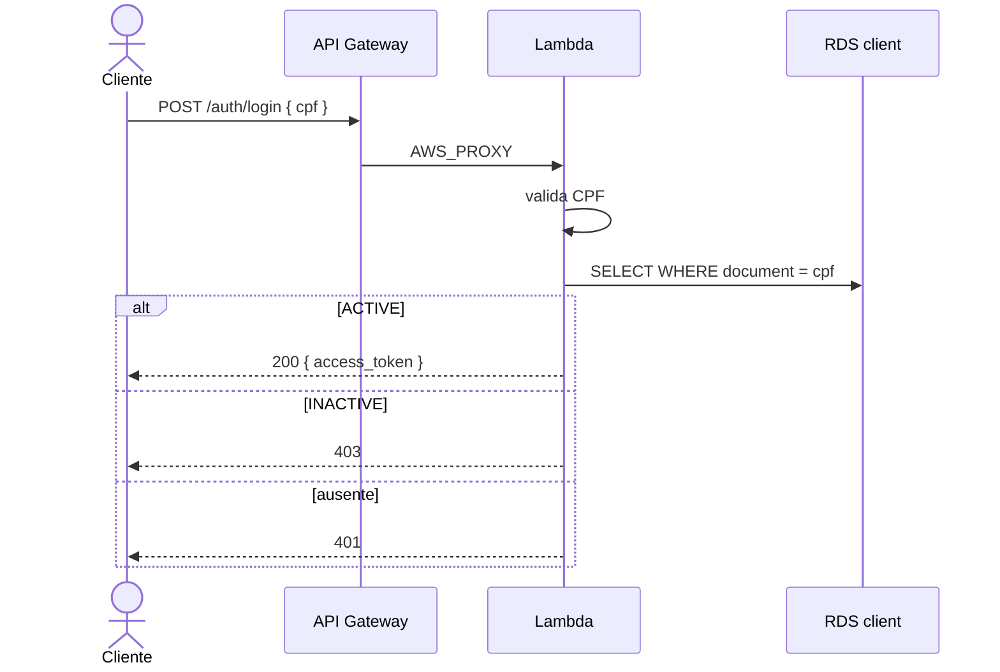

# lambda-auth — autenticação por CPF

## Propósito

Function serverless que autentica o cliente da oficina. Expõe `POST /auth/login` no API Gateway HTTP: valida o CPF, consulta existência e status na tabela `client` do **RDS PostgreSQL** e devolve um JWT que a API NestJS aceita.

## Tecnologias

- Node.js 20, TypeScript, esbuild
- AWS Lambda + API Gateway HTTP (v2)
- Driver `pg` (PostgreSQL)
- `cpf-cnpj-validator`, `jsonwebtoken`
- Terraform >= 1.5
- Layer New Relic (quando a license key existe)

Não há Dockerfile: o artefato é zip de `dist/`, runtime `nodejs20.x`.

## Pré-requisitos

1. `infra-database` aplicado (RDS na VPC)
2. `infra-kubernetes` aplicado (VPC e subnets privadas)
3. GitHub Secrets: `AWS_ACCESS_KEY_ID`, `AWS_SECRET_ACCESS_KEY`, `AWS_SESSION_TOKEN`, `DATABASE_URL`, `JWT_SECRET`
4. Opcionais: `NEW_RELIC_LICENSE_KEY`, `NEW_RELIC_ACCOUNT_ID`

O `JWT_SECRET` tem de ser o mesmo do Deployment da API. Payload: `sub` = `id` do cliente, `email`, `role: "cliente"`.

## Execução

```bash
npm ci
npm run build
./scripts/tf-init.sh
cd terraform/environments/prod
terraform plan
terraform apply
```

## Deploy

Push na `main` roda [`Deploy Prod`](.github/workflows/deploy-prod.yml): build, `terraform apply`, smoke `POST /auth/login`.

## Ordem de deploy

1. infra-database
2. infra-kubernetes
3. app
4. lambda-auth

## Pipeline

| Workflow | Gatilho | O que faz |
|---|---|---|
| [`terraform-plan.yml`](.github/workflows/terraform-plan.yml) | PR para `main` | build, `fmt`, `validate`, `plan` |
| [`deploy-prod.yml`](.github/workflows/deploy-prod.yml) | push na `main` | build, `apply`, curl no login |

A `main` é protegida.

## Diagrama deste repositório



## APIs

- Contrato: `POST /auth/login` `{ "cpf": "52998224725" }` → `{ "access_token": "..." }`
- Header de correlação: envie e receba `x-request-id`
- A API protegida e o Swagger ficam no `app`: http://localhost:3000/api

```bash
API_URL=$(terraform -chdir=terraform/environments/prod output -raw api_gateway_url)
curl -X POST "${API_URL}/auth/login" \
  -H "Content-Type: application/json" \
  -H "x-request-id: demo-login-1" \
  -d '{"cpf":"52998224725"}'
```
